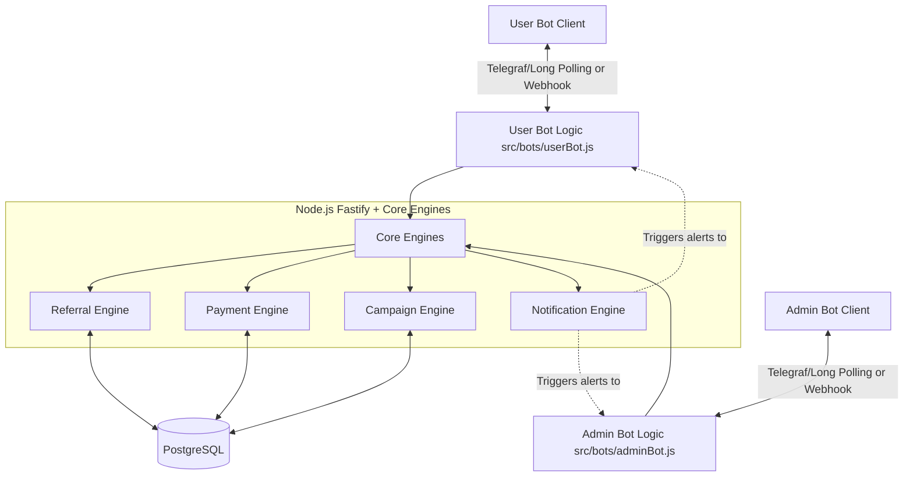

# TezPul System Architecture

## Overview
The TezPul Telegram SaaS system is designed as a centralized Node.js application utilizing Fastify for internal API structuring and a PostgreSQL database as the single source of truth. The system manages two distinct Telegram bots:
1. **User Bot**: Serves standard users, tracks referrals, manages channel subscriptions, and displays balances.
2. **Admin Bot**: Serves administrators, allows management of campaigns, tracking and approving payouts, and uploading payment proofs.

## Core Principles
1. **Decoupled Bot Communication**: The User Bot and Admin Bot **never** communicate directly. 
2. **Backend as Source of Truth**: All data, states, balances, and calculations are maintained within the PostgreSQL database. The bots act strictly as presentation/UI layers.
3. **Event-Driven Interactions**: State changes triggered by one bot (e.g., an Admin uploading a payment proof) hit a central backend engine which then asynchronously notifies the other bot using a Notification Engine.

## Architecture Diagram

## Database Schema (PostgreSQL)

### `users`
- `id` (UUID, Primary Key)
- `telegram_id` (BIGINT, Unique)
- `username` (VARCHAR)
- `name` (VARCHAR)
- `phone` (VARCHAR)
- `role` (VARCHAR: 'user', 'admin', 'super_admin')
- `balance` (DECIMAL)
- `language` (VARCHAR: 'uz', 'ru', 'en')

### `referrals`
- `id` (UUID, Primary Key)
- `user_id` (UUID, Foreign Key -> users)
- `referrer_id` (UUID, Foreign Key -> users)
- `campaign_code` (VARCHAR)

### `campaigns`
- `id` (UUID, Primary Key)
- `name` (VARCHAR)
- `reward` (DECIMAL)
- `channel_id` (BIGINT)
- `is_active` (BOOLEAN)

### `payments`
- `id` (UUID, Primary Key)
- `user_id` (UUID, Foreign Key -> users)
- `total_amount` (DECIMAL)
- `paid_amount` (DECIMAL)
- `remaining_amount` (DECIMAL)
- `status` (VARCHAR: 'pending', 'partial', 'paid')
- `proof_image` (VARCHAR) - Telegram file_id

### `admin_channels`
- `id` (UUID, Primary Key)
- `admin_id` (UUID, Foreign Key -> users)
- `channel_name` (VARCHAR)

## Event Flow Examples

### Referral Reward Flow
1. User A shares referral link `/start ref_123`
2. User B starts the bot. **User Bot** receives event.
3. **User Bot** calls `ReferralEngine.registerReferral(userB, userA)`.
4. **ReferralEngine** verifies channel subscriptions.
5. **ReferralEngine** calculates reward (100% direct, 50% parent) and updates DB.
6. **ReferralEngine** triggers `NotificationEngine.notifyNewReferral(userA, rewardAmount)`.
7. **NotificationEngine** instructs the **User Bot** to send a success message to User A.

### Payment Proof Flow
1. Admin transfers money via external banking app.
2. Admin uploads a screenshot to the **Admin Bot**.
3. **Admin Bot** captures the `file_id` and calls `PaymentEngine.addPaymentProof(paymentId, fileId, amount)`.
4. **PaymentEngine** updates `paid_amount`, `remaining_amount`, `status`, and `proof_image` in DB.
5. **PaymentEngine** triggers `NotificationEngine.notifyPaymentUpdate(userId, paymentId)`.
6. **NotificationEngine** instructs the **User Bot** to send the `file_id` (as a photo) and a text update to the User.
